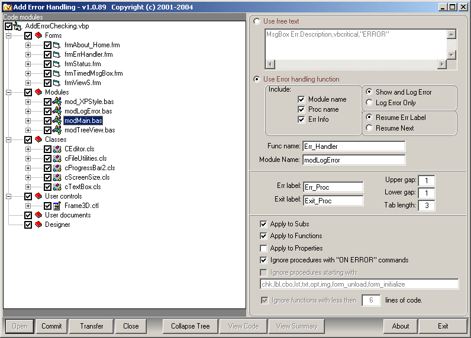



## Error Handling Utility

### Description

(Update 2/17/05) You should include error handling in every procedure of your application regardless of its size or purpose. Usually, during an application’s design phase, we naturally include “ON ERROR RESUME NEXT” to handle expected errors while we are writing the code. The problem occurs when the initial design is complete; we don’t always go back and add error trapping for those unexpected errors. This is usually because it takes to much time or we meant to but just miss some when we did. This utility will add error trapping and logging to all the procedures in your code that you didn’t. View the read_me document for more information. I am not interested in trying to winning the monthly contest so please DON’T vote; save your votes for those who are.
 
### More Info
 

             |
---                |---
**Submitted On**   |2005-02-17 09:44:40
**By**             |[Morgan Haueisen](https://github.com/Planet-Source-Code/PSCIndex/blob/master/ByAuthor/morgan-haueisen.md)
**Level**          |Advanced
**User Rating**    |4.5 (63 globes from 14 users)
**Compatibility**  |VB 6\.0
**Category**       |[Complete Applications](https://github.com/Planet-Source-Code/PSCIndex/blob/master/ByCategory/complete-applications__1-27.md)
**World**          |[Visual Basic](https://github.com/Planet-Source-Code/PSCIndex/blob/master/ByWorld/visual-basic.md)
**Archive File**   |[Error\_Hand1853952172005\.zip](https://github.com/Planet-Source-Code/morgan-haueisen-error-handling-utility__1-58765/archive/master.zip)

